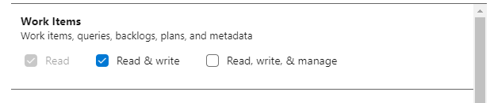

# Azure Devops Work Item Command Line Tool

Simple tool to support the following Azure DevOps Work Item `$commands` on the terminal for a configured user

```
list   - lists all work items that are not in Done|Removed state for user configured
open   - opens work item by ID in the browser
read   - renders text representation of work item with ID in the terminal
create - creates a new work item
move   - moves work item to state
close  - close work items i.e. moves to 'Done' state
```

---

## Example Usage

```yaml
# Show All Work Items assigned to user & not closed in the configured areaPath
ado list
# Show All Work Items not closed in all areaPaths
ado list --all

# Open the Azure DevOps Work Item with ID 12512 in the browser
ado open 12512

# Read a Work Item in the Terminal
ado read 12512

# Read and output as json
ado read 12512 --json

# Create a Task with passed Title and Description with Work Item 12512 as a Parent
# Users should use logically hierarchy structures - this is not enforced by Azure DevOps!
# Only child -> parent relationship supported at the moment with this tool
ado create "Example Title" "Example Description" -wit "Task" -p 12512

# Move a Work Item to a State and add an optional comment
ado move 12533 "Resolved" "Work Completed and ready for review"

# Close a Work Item with an optional comment
ado close 12533 "Work Item Completed"

# Contextual Help can be found with -h or --help
ado create -h
```

---

## Example Outputs


---

## Requirements

:ballot_box_with_check: Python 3  
:ballot_box_with_check: Azure DevOps Account with PAT Token

---

## Install With PipX

`pipx` supports (virtual) environment isolated Python CLI applications (+dependencies) independent/isolated from callers
environment

Install `pipx`
- [Install guide here](https://packaging.python.org/en/latest/guides/installing-stand-alone-command-line-tools/)

Pull Repository

```
git clone https://github.com/owenmather/ado-cli.git
```

Install the Application with Pipx

```
cd tools-ado-cli
pipx install . --force
``` 

Set `PAT_TOKEN` in environment - needs **Read & Write** permissions
- [How to create a PAT Token](https://learn.microsoft.com/en-us/azure/devops/organizations/accounts/use-personal-access-tokens-to-authenticate?view=azure-devops&tabs=Windows)

```shell
$ export PAT_TOKEN=XXXXX
```

> 


Configure properties in `.ado-config.yml` file [_(see supported properties here)_](#properties)
and  [an example file here](.example-ado-config.yml)  
Place your config file in `~/.ado/.ado-config.yml` (or in` %UserProfile%\.ado/.ado-config.yml` on Windows) 

*Alternatively configure the Path to the config file as an Environment Variable

```shell
$ export ADO_CONFIG_FILE=/path/to/ado-config.yml
```

The application _should_ now be usable  
**may require a terminal restart if `pipx` was installed in same session**  

Run `ado -h` on terminal for usage & help

---
## Properties

The following properties are supported in `.ado-config.yml`

```yaml
username: "xxx@domain.com" #email address for user. Used in Auth with PAT_TOKEN from environment
organization: "my-organization" # Azure DevOps Organization Name - PAT_TOKEN must have valid access
project: "MyProject" # Azure DevOps Project Name - PAT_TOKEN must have valid access
apiVersion: "5.0" # Version of Azure DevOps Restapi to Use - PAT_TOKEN must have valid access
areaPath: MyProject\Frontend # Area Path to Work From - can be passed with -ap arg or ignored with --all
browser: chrome #Command line switch for browser used - [iexplore|chome|firefox] - Browser launched with `ado open $ID`
color: false #enable terminal colors | not working for all terminals
tablefmt: simple #Any tablefmt supported by tabulate for output https://github.com/astanin/python-tabulate#table-format
iteration: MyProject\Frontend\Iteration 1.1 # <optional> if set work items created with `ado create` will default to this iteration. Do not put in quotes "". Alternatively pass with `-it` flag
hierarchy: false #enable hierarchy sorting and view for parent - child relationships (example below)
LOGLEVEL: INFO # Valid LOGLEVEL (DEBUG|ERROR|INFO etc). Default is INFO
```
---
## :flags: Environment Variables

The following environment variables are supported

| **Key**         | **Description**                             | **Example Values**                                 |
|-----------------|---------------------------------------------|----------------------------------------------------|
| PAT_TOKEN       | **<required\>** Auth Token for Azure DevOps | fg2s5ASs34mezmczoct3u6ut65sEg2bx990eill7h7r4fhv7pp |
| ADO_CONFIG_FILE | **<optional\>** Path to `.ado-config.yml`   | /path/to/.ado-config.yml                           |


---
## Hierarchy View Example

Enabling `hierarchy` view sorts and displays parent-child relationships in terminal
```yaml
hierarchy: true
```

